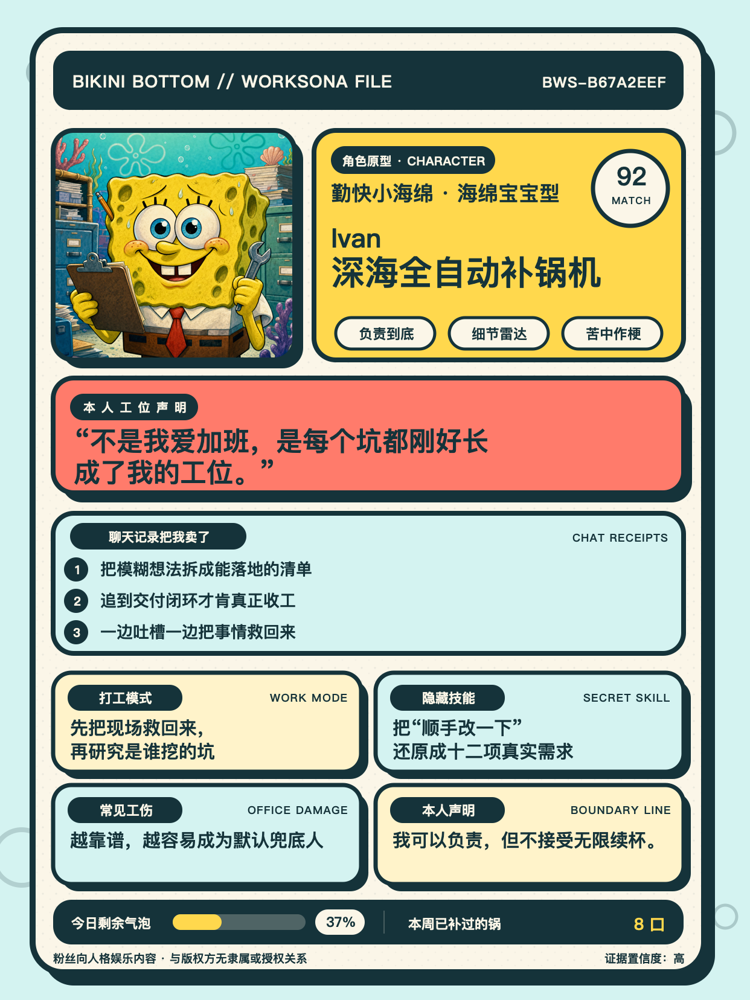

English | [简体中文](README.zh-CN.md) | [日本語](README.ja.md) | [한국어](README.ko.md) | [Español](README.es.md) | [Português](README.pt.md) | [Français](README.fr.md)

<p align="center">
  
</p>

<h1 align="center">Bikini Bottom Worksona</h1>

<p align="center">
  <strong>Conversation style → a funny, empathetic worksona card</strong>
</p>

<p align="center">
  <a href="SKILL.md"></a>
  <a href="https://agentskills.io/specification"></a>
  <a href="LICENSE"></a>
</p>

<p align="center">
  
</p>

> See the result first: the repository ships a generated example card so the product value is visible before installation.

Turn the conversation style visible to your agent into a standardized **Bikini Bottom-inspired worksona card**: a character mapping, a relatable workplace identity, a sharp repostable line, and a Xiaohongshu-ready caption.

The Skill is designed for playful self-expression, not psychological diagnosis. It only analyzes conversation content that the current host actually exposes.

## What it does

| Capability | Result |
| --- | --- |
| Conversation evidence | Builds an internal ledger of 18–36 distinct signals from the largest authorized conversation corpus available, then selects three shareable receipts. |
| Character mapping | Maps the signals to a SpongeBob/Bikini Bottom archetype with a score and confidence level. |
| Worksona writing | Produces a title, tagline, three “chat receipts,” work mode, hidden skill, workplace wound, and boundary line. |
| Social card | Renders a fixed 1242×1656 px (3:4) SVG and PNG layout for mobile sharing. |
| Share copy | Writes a copy-paste Markdown caption with hooks and hashtags. |
| Safety | Uses paraphrases, avoids sensitive inferences, and defaults public visuals to an original archetype or placeholder; personal fan mode includes role-matched default avatars. |

## Quick start

### Install with the Skills CLI

For agents that support the open Skills convention:

```bash
npx skills add https://github.com/woodfantasy/create-bikini-bottom-worksona
```

You can also clone the repository into a host-specific Skill directory:

```bash
# Claude Code
git clone https://github.com/woodfantasy/create-bikini-bottom-worksona.git .claude/skills/create-bikini-bottom-worksona

# Codex
git clone https://github.com/woodfantasy/create-bikini-bottom-worksona.git .agents/skills/create-bikini-bottom-worksona
```

### Install with the included helper

From the cloned repository root:

```bash
python3 scripts/install_skill.py --target claude-code
python3 scripts/install_skill.py --target codex
python3 scripts/install_skill.py --target antigravity
python3 scripts/install_skill.py --target openclaw
```

Preview all destinations first with `--target all --dry-run`. The helper never overwrites an existing installation unless `--force` is supplied; forced replacement creates a timestamped backup.

### Host-specific notes

| Host | Personal install | Project install |
| --- | --- | --- |
| Claude Code | `~/.claude/skills/create-bikini-bottom-worksona` | `<project>/.claude/skills/create-bikini-bottom-worksona` |
| Claude | Build the ZIP locally, then upload it in Settings → Features/Capabilities → Skills | — |
| Codex | `~/.agents/skills/create-bikini-bottom-worksona` | `<project>/.agents/skills/create-bikini-bottom-worksona` |
| Google Antigravity | `~/.gemini/config/skills/create-bikini-bottom-worksona` | `<project>/.agents/skills/create-bikini-bottom-worksona` |
| OpenClaw | `~/.openclaw/skills/create-bikini-bottom-worksona` | `<workspace>/skills/create-bikini-bottom-worksona` |

For OpenClaw, the repository can also be installed with:

```bash
openclaw skills install git:woodfantasy/create-bikini-bottom-worksona --global
```

For Claude, create the upload archive after cloning:

```bash
python3 scripts/package_skill.py --output /tmp/create-bikini-bottom-worksona.zip
```

## How to use it

Ask the agent directly. Mention the evidence boundary when you want a careful result:

```text
分析我在这段对话里的沟通风格，看看我最像哪个海绵宝宝角色。
重点写出“事情全是我做，锅还是我背”的打工情绪，生成一张适合小红书的 3:4 人设卡。
```

```text
Based only on the conversation visible in this chat, make me a funny but empathetic worksona card.
Include the character match, three chat receipts, my hidden skill, workplace wound, and a quotable boundary line.
```

To maximize confidence, ask it to review every turn visible to the current host plus any history you explicitly authorize:

```text
Review the largest conversation corpus you are actually allowed to access—not just the latest messages.
Build an 18–36-note internal evidence ledger across sessions, topics, and time periods; include my corrections and reactions to Agent replies.
Report the inspected coverage, then compress the strongest recurring patterns into the three card receipts.
```

If the host exposes too little history, the Skill asks for permission to use its conversation search or for an export of roughly 20–60 representative interaction units. You can also ask it to continue with a clearly labeled low-confidence draft.

The default workflow is:

1. Establish the accessible corpus and report its session, topic, and time coverage.
2. Read all available turns or use stratified sampling for a large corpus; extract and deduplicate 18–36 recurring behavioral signals.
3. Write the standardized profile without diagnosing the user.
4. Compress the internal ledger into three “聊天记录把我卖了 / Chat receipts” share hooks.
5. Validate dimensions, readability, privacy, rights mode, and evidence coverage before delivery.

## Local rendering

Create a profile JSON that follows `references/profile-schema.md`, then run:

```bash
python3 scripts/validate_profile.py worksona-profile.json
python3 scripts/render_card.py \
  --input worksona-profile.json \
  --output worksona-card.svg \
  --png worksona-card.png \
  --caption worksona-caption.md
```

The master card is exactly **1242×1656 px**, a Xiaohongshu-friendly 3:4 portrait. SVG is the portable source of truth; PNG is generated when a supported local rasterizer is available.

## Output fields

Every profile contains:

- character ID, character name, match score, and confidence;
- `worksona_title` and `tagline`;
- three evidence-based `evidence` items, written as chat receipts;
- `work_mode`, `hidden_skill`, `workplace_wound`, and `boundary_line`;
- playful battery and patch-count stats;
- optional secondary character, avatar, image mode, source note, and privacy-safe coverage note.

The three `evidence` strings are card-sized share copy, not the amount of conversation analyzed. The fuller evidence ledger stays in temporary working notes and is never published with private source text; ask for an anonymized appendix when you want to inspect more of the reasoning.

The complete schema and character guidance live in [`references/`](references/).

## Privacy, IP, and sharing

- Analyze only visible conversation or files the user explicitly authorizes.
- Paraphrase evidence; do not publish verbatim private messages, names, employers, phone numbers, tokens, or other secrets.
- Treat the result as entertainment and self-expression, never as a clinical or employment assessment.
- This is an unofficial fan-expression project and is not affiliated with or endorsed by the SpongeBob rights holders.
- This repository includes one newly generated SpongeBob fan-art avatar and sample card to make the product legible at a glance. They are unofficial, for personal/non-commercial fan expression, and do not imply affiliation, endorsement, or commercial clearance.
- Personal fan mode includes a generated default avatar for every roster role; when no image tool is available, the renderer selects `assets/default-avatars/<character_id>.png` instead of the neutral placeholder.
- For commercial, paid, branded, or otherwise public-facing outputs, replace the fan avatar with original or rights-cleared art and set `image_mode` to `original` or `licensed`. Do not add episode stills, scraped PNGs, marketplace screenshots, logos, franchise fonts, or third-party fan art.

## Project structure

```text
create-bikini-bottom-worksona/
├── SKILL.md                     # Agent instructions and workflow
├── README*.md                   # Multilingual documentation
├── agents/openai.yaml           # Codex display metadata
├── assets/                      # Sample avatar, 12-role default pack, placeholder, and card
├── references/                  # Rubric, roster, avatar system, schema, card, safety, sharing
└── scripts/
    ├── install_skill.py         # Host installation helper
    ├── package_skill.py         # Claude-compatible ZIP builder
    ├── render_card.py           # SVG/PNG/caption renderer
    ├── validate_profile.py      # Stdlib-only JSON validator
    └── validate_avatar_pack.py  # 12-role fallback asset validator
```

## Validate and package

```bash
python3 /path/to/skill-creator/scripts/quick_validate.py .
skills-ref validate "$(pwd)"
python3 scripts/validate_avatar_pack.py
python3 scripts/package_skill.py --output /tmp/create-bikini-bottom-worksona.zip
unzip -t /tmp/create-bikini-bottom-worksona.zip
```

## Contributing

Keep the card format stable, preserve the evidence boundary, and add new character or copy guidance to `references/` before changing the renderer. Please do not contribute unlicensed franchise artwork or private conversation exports.

## License

The code and documentation are released under the [MIT License](LICENSE). SpongeBob-related names and characters remain the property of their respective rights holders; this repository does not grant rights to that IP.
